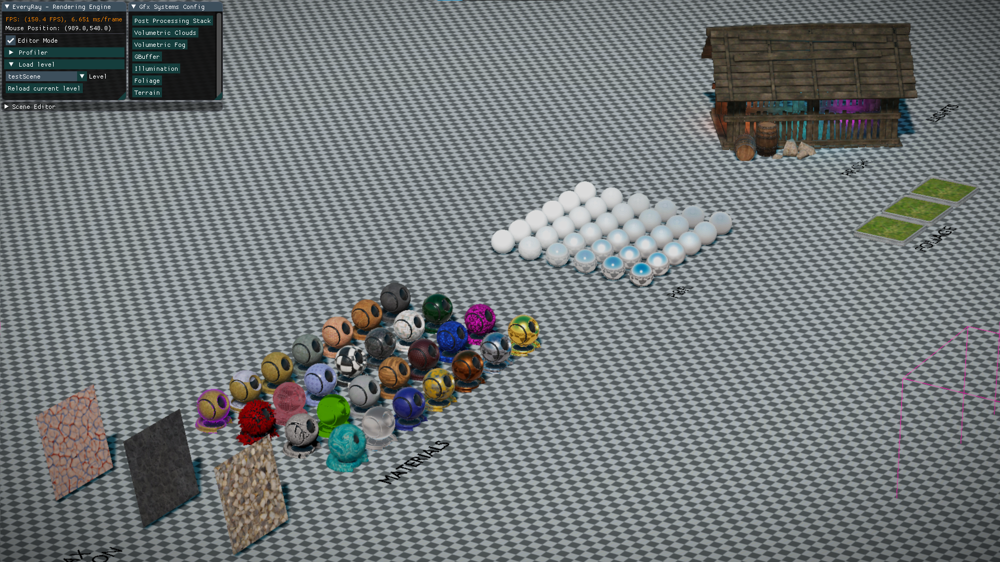
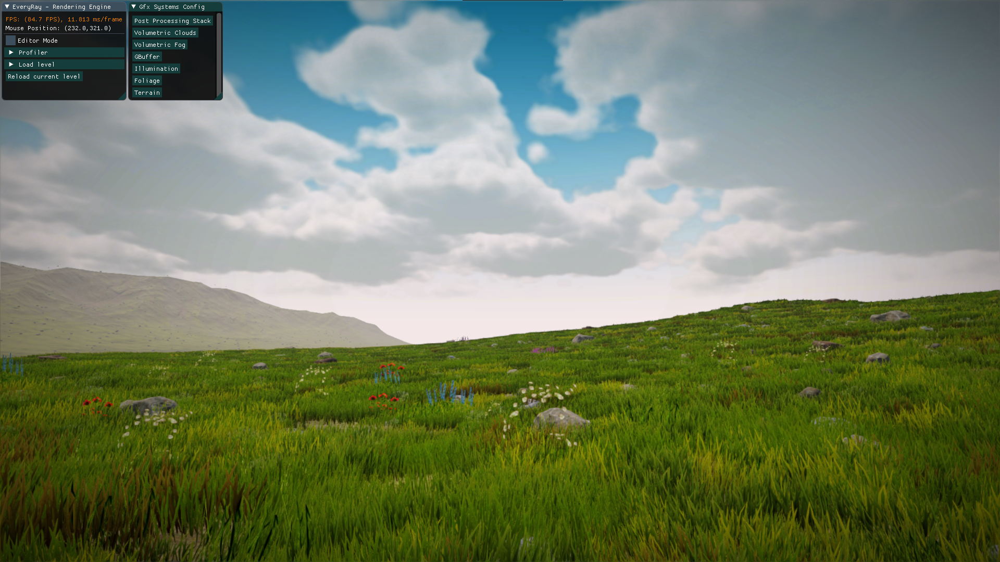

# EveryRay-Rendering-Engine

 

Ver 1.0 ([Change Log](https://github.com/steaklive/EveryRay-Rendering-Engine/blob/master/CHANGE_LOG.md)) 

 

# Introduction
"EveryRay" is a _rendering engine_ that is written in C++ with a focus on quick prototyping of graphical techniques and features. It is lightweight, easy to use and already contains many existing rendering solutions inside.

"EveryRay" is **not** a _game engine_. It was never made with that in mind which resulted in building the engine with a minimal amount of components/systems outside the graphics part. It is not impossible to make a proper game engine out of "EveryRay", however, there are many other projects that were architectured specifically for that instead.

"EveryRay" is **not** a _library_ that can be disconnected and connected to your project either. It is not modular and was never meant to be. However, there is at least a distinction between low-level graphics code and high-level systems in the engine which you can borrow for your own needs.

Lastly, "EveryRay" was made by a graphics programmer for those who are interested in real-time rendering and who do not want to spend time setting up a bunch of engine-related things that are needed when you begin writing your personal engine of any kind. You can think of "EveryRay" as a "toy engine/tech demo on steroids" or, in other words, a simple sandbox with minimal UI for testing complex ideas with the help of various prepared functionalities.

You can read more about the architecture of "EveryRay" in the documentation:
- [Engine Overview](https://github.com/steaklive/EveryRay-Rendering-Engine/blob/master/doc/Engine_Overview.md) 
- [Graphics Overview](https://github.com/steaklive/EveryRay-Rendering-Engine/blob/master/doc/Graphics_Overview.md) 

You can see a video demonstration of "EveryRay" here (scroll down for screenshots):
- https://youtu.be/_htQNxesr9U (TODO to be updated)

# Rendering features
- Deferred + Forward Rendering
- Local illumination w/ Physically Based Rendering
- Global illumination w/:
- - Static: Image Based Lighting from light probes:
- - - diffuse (2nd order spherical harmonics)
- - - specular (cubemaps)
- - Dynamic: Cascaded Voxel Cone Tracing (_AO, diffuse, specular_)
- Cascaded Shadow Mapping
- Parallax-Occlusion Mapping w/ soft self-shadowing
- Terrain w/ GPU tessellation
- Foliage zones
- Volumetric clouds
- Volumetric fog
- Post Processing Volumes with _Linear Fog, Screen Space Reflections, Separable Subsurface Scattering, Tonemapping, LUT color grading, Vignette, Anti-aliasing (FXAA)_
- Special materials: _Snow, Fresnel-Outline, Fake-Transparency (reflect+refract), Fur Shell_

You can read more in [Graphics Overview](https://github.com/steaklive/EveryRay-Rendering-Engine/blob/master/doc/Graphics_Overview.md) 

# Engine features
- Concept of an "ER_RHI" (aka "Rendering Hardware Interface"): graphics API is abstracted from the general code (systems, etc.)
- - supports DX11, DX12
- Concept of a simplified generic game object - "ER_RenderingObject":
- - supports model loading (.obj, .fbx and etc.) with Assimp Library
- - supports multiple meshes
- - supports texture loading (.png, .jpg, .dds)
- - supports materials
- - supports GPU instancing
- - supports LOD groups
- - supports indirect GPU rendering (GBuffer, Shadow, Forward passes) w/ GPU culling
- - supports AABB (with visualization)
- - supports on-terrain procedural placement & instances distribution
- - customizable via "Object editor" (with instancing support)
- Concept of a generic scene, which contains "ER_RenderingObject" elements + scene data (lights, terrain, GI and other info):
- - supports loading from & saving to JSON scene files
- Concept of graphics presets for achieving performance on various hardware configurations
- - loaded from [graphics_config.json file](https://github.com/steaklive/EveryRay-Rendering-Engine/blob/master/graphics_config.json)
- - impacts the quality of several systems (resolutions, shadows, textures, etc.)
- CPU frustum culling
- ImGUI, ImGuizmo
- Input from mouse, keyboard and gamepad (XInput, but you can add your own)

 You can read more in [Engine Overview](https://github.com/steaklive/EveryRay-Rendering-Engine/blob/master/doc/Engine_Overview.md) 

# Controls
- "Mouse + Right Click" or "Right Thumbstick" - camera rotation
- "W/A/S/D" or "Left Thumbstick" - camera side movement (on gamepad holding "Left Trigger"/"Right Trigger" will slow/fasten the movement)
- "E/Q" - camera up/down movement
- "Backspace" or "Back Gamepad Button" - enable/disable editor
- "R/T/Y" - scale/translate/rotate object in the editor mode

Gamepad is currently not supported/tested with ImGui.

# Screenshots

# Scenes

Over the years many scenes have been created for "EveryRay". However, to make things simpler, only a few are included in the public version of this repository:
| Name               | Description | Screenshot  |
| -----------        | ----- | ----------- |
| testScene_simple   | Default startup scene with a few basic objects | 
| testScene          | Advanced scene with various materials, post-effects volumes, foliage, lights, and light probes | 
| terrainScene       | Foliage and several types of GPU indirect objects scattered on top of terrain | 

Learn more about levels in [Engine Overview](https://github.com/steaklive/EveryRay-Rendering-Engine/blob/master/doc/Engine_Overview.md) 

# Roadmap
Big features that require a branch/merge request and a considerable amount of time.

_Engine_
 * [X] <del>remove DX11 "Effects" library, all .fx shaders and refactor the material system (DONE)</del> (https://github.com/steaklive/EveryRay-Rendering-Engine/pull/51)
 * [X] <del>remove all low-level DX11 code and put it into the abstracted RHI (DONE)</del> (https://github.com/steaklive/EveryRay-Rendering-Engine/pull/56)
 * [X] <del>add support for DX12 (DONE)</del> (https://github.com/steaklive/EveryRay-Rendering-Engine/pull/57)
 * [ ] remove DirectXMath and its usages (maybe come up with a custom math lib)
 * [ ] add cross-API shader compiler
 * [ ] add simple job-system (i.e. for Update(), CPU culling, etc.)
 * [ ] add support for multi-threaded command lists on modern APIs (after job-system)
 * [ ] add simple memory management system (for now CPU memory; at least linear, pool allocators)

_Graphics_
 * [ ] Order Independent Transparency (in Forward pass)
 * [ ] Atmospheric Scattering (Mie, etc.)
 * [ ] Contact hardening shadows
 * [ ] Stochastic reflections
 * [ ] Better Anti-Aliasing (SMAA, TAA, explore FSR/DLSS)
 * [ ] Hardware accelerated ray-tracing (i.e., DXR shadows, reflections, AO)
 * [ ] High-poly geometry with mesh shaders

# External Dependencies
- DirectXTK (https://github.com/Microsoft/DirectXTK)
- ImGui (https://github.com/ocornut/imgui)
- Assimp 5.0.1 (https://github.com/assimp/assimp)
- JsonCpp (https://github.com/open-source-parsers/jsoncpp/)

# References
- "Real-Time 3D Rendering with DirectX and HLSL: A Practical Guide to Graphics Programming" by Paul Varcholik
- "Real-Time Rendering" 3rd/4th ed. by Tomas Möller, Naty Hoffman, Eric Haines
- "GPU Gems" series
- "GPU Pro" series
- numerous SIGGRAPH, GDC papers, and blog posts by fellow graphics geeks and vendors :)
 
# Requirements
- Visual Studio 2019
- Windows 10 + SDK
- DirectX 11 or DirectX 12 supported hardware
- You might increase TDR time of your GPU driver (explained here https://docs.substance3d.com/spdoc/gpu-drivers-crash-with-long-computations-128745489.html).
