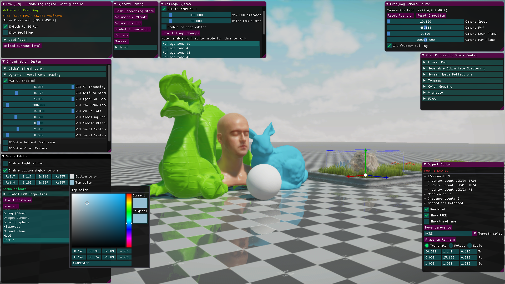
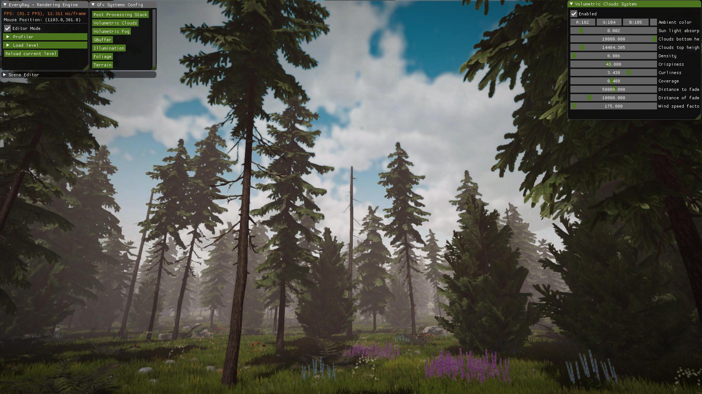
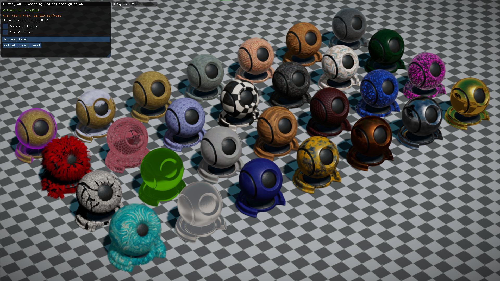
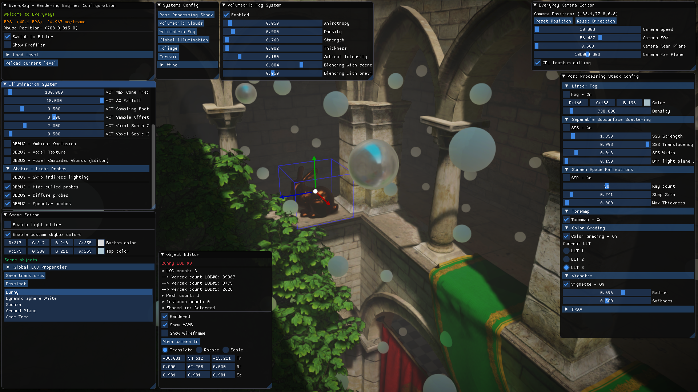

# EveryRay-Rendering-Engine

# Overview
"EveryRay" is a rendering engine which is written in C++ and which focuses on quick prototyping of graphical techniques and features. It is lightweight, easy to use and already contains many existing rendering solutions inside.

Supported APIs/platforms (public):
- Win64:
- - DirectX 11
- - DirectX 12

Video demonstrations (scroll down for screenshots):
- https://youtu.be/_htQNxesr9U (to be updated)

***
**Note (will be removed with v1.0)**: after years of development and increased popularity on Github in recent months, I decided to start preparing the release of the first proper version of this project (v1.0). I would like to: add a wiki page, license, refactored structure and, most importantly, clean all the previous functionalities and make them ready to be used by the public. 
***

# Some of the rendering features
- Deferred + Forward Rendering
- Local illumination w/ Physically Based Rendering
- Global illumination w/:
- - Static: Image Based Lighting from light probes:
- - - diffuse (2nd order spherical harmonics)
- - - specular (cubemaps)
- - Dynamic: Cascaded Voxel Cone Tracing (AO, diffuse, specular)
- Cascaded Shadow Mapping
- Parallax-Occlusion Mapping w/ soft self-shadowing
- Terrain w/ GPU tessellation
- Foliage zones
- Volumetric clouds
- Volumetric fog
- Post Processing Volumes:
- - Linear Fog
- - Screen Space Reflections
- - Separable Subsurface Scattering
- - Tonemapping
- - LUT color grading
- - Vignette
- - Anti-aliasing (FXAA)
- Special extra materials:
- - Snow Material
- - Fresnel-Outline Material
- - Fake-Transparency Material (reflect+refract)
- - Fur Shell Material

# Some of the engine concepts/features
- Concept of an "ER_RHI" (aka "Rendering Hardware Interface"): graphics API is abstracted from the general code (systems, etc.)
- Concept of a simplified generic game object - "ER_RenderingObject":
- - supports model loading (.obj, .fbx and etc.) with Assimp Library
- - supports multiple meshes
- - supports texture loading (.png, .jpg, .dds)
- - supports materials
- - supports GPU instancing
- - supports LOD groups
- - supports indirect GPU rendering (GBuffer, Shadow, Forward passes) w/ GPU culling
- - supports AABB (with visualization)
- - supports on-terrain procedural placement & instances distribution
- - customizable via "Object editor" (with instancing support)
- Concept of a generic scene, which contains "ER_RenderingObject" elements + scene data (lights, terrain, GI and other info):
- - supports loading from & saving to JSON scene files
- Concept of graphics presets for achieving performance on various hardware configurations
- - loaded from graphics_config.json file
- - impacts the quality of several systems (resolutions, shadows, textures)
- CPU frustum culling
- ImGUI, ImGuizmo
- Input from mouse, keyboard and gamepad (XInput, but you can add your own)
 
# Roadmap - Engine Architecture
 * [X] <del>remove DX11 "Effects" library, all .fx shaders and refactor the material system (DONE)</del> (https://github.com/steaklive/EveryRay-Rendering-Engine/pull/51)
 * [X] <del>remove all low-level DX11 code and put it into the abstracted RHI (DONE)</del> (https://github.com/steaklive/EveryRay-Rendering-Engine/pull/56)
 * [X] <del>add support for DX12 (DONE)</del> (https://github.com/steaklive/EveryRay-Rendering-Engine/pull/57)
 * [ ] remove DirectXMath and its usages (maybe come up with a custom math lib)
 * [ ] add cross-API shader compiler
 * [ ] add simple job-system (i.e. for Update(), CPU culling, etc.)
 * [ ] add support for multi-threaded command lists on modern APIs (after job-system)
 * [ ] add simple memory management system (for now CPU memory; at least linear, pool allocators)

# Roadmap - Graphics
 * [ ] Order Independent Transparency (in Forward pass)
 * [ ] Atmospheric Scattering (Mie, etc.)
 * [ ] Contact hardening shadows
 * [ ] Stochastic reflections
 * [ ] Better Anti-Aliasing (SMAA, TAA, explore FSR/DLSS)
 * [ ] Hardware accelerated ray-tracing (i.e., DXR shadows, reflections, AO)
 * [ ] High-poly geometry with mesh shaders

# Note on the API
I originally started developing this project on DX11 several years ago with the mindset of DX11/OpenGL-era APIs (single threaded renderer, immediate context, etc.). However, only recently I added support for DX12 into EveryRay and, unfortunately, I only had time for "1 to 1" port from DX11 to DX12 (which also took many months and is still not 100% ready to replace DX11). That means that DX12 is currently underused in the engine and is not bringing any improvements yet (in performance, for example). This will likely change in the future, as I start refactoring/adding support to many new DX12-era concepts (i.e. async compute, multithreaded command list submission, bindless, etc.). That will take time and serious changes in the architecture of EveryRay, but it would be worth it alongside with other novel features, like DirectX Raytracing or mesh shaders. DX12 can really be more powerful than DX11 when you treat it with care:)

# Screenshots

# Controls
- "Mouse + Right Click" or "Right Thumbstick" - camera rotation
- "W/A/S/D" or "Left Thumbstick" - camera side movement (on gamepad holding "Left Trigger"/"Right Trigger" will slow/fasten the movement)
- "E/Q" - camera up/down movement
- "Backspace" or "Back Gamepad Button" - enable/disable editor
- "R/T/Y" - scale/translate/rotate object in the editor mode

Gamepad is currently not supported/tested with ImGui.

# Notes
- You might increase TDR time of your GPU driver (explained here https://docs.substance3d.com/spdoc/gpu-drivers-crash-with-long-computations-128745489.html).

# External Dependencies
- DirectXTK (https://github.com/Microsoft/DirectXTK)
- ImGui (https://github.com/ocornut/imgui)
- Assimp 5.0.1 (https://github.com/assimp/assimp)
- JsonCpp (https://github.com/open-source-parsers/jsoncpp/)

# References
- "Real-Time 3D Rendering with DirectX and HLSL: A Practical Guide to Graphics Programming" by Paul Varcholik.
- "Real-Time Rendering" 3rd/4th ed. by Tomas Möller, Naty Hoffman, Eric Haines
- "GPU Gems" series from NVIDIA
- "GPU Pro" series by Wolfgang Engel
- numerous SIGGRAPH, GDC papers and blogposts by fellow graphics geeks and vendors :)
 
# Requirements
- Visual Studio 2019
- Windows 10 + SDK
- DirectX 11 or DirectX 12 supported hardware
