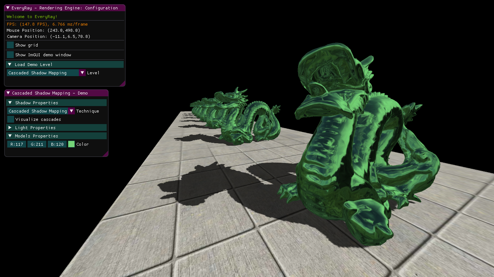
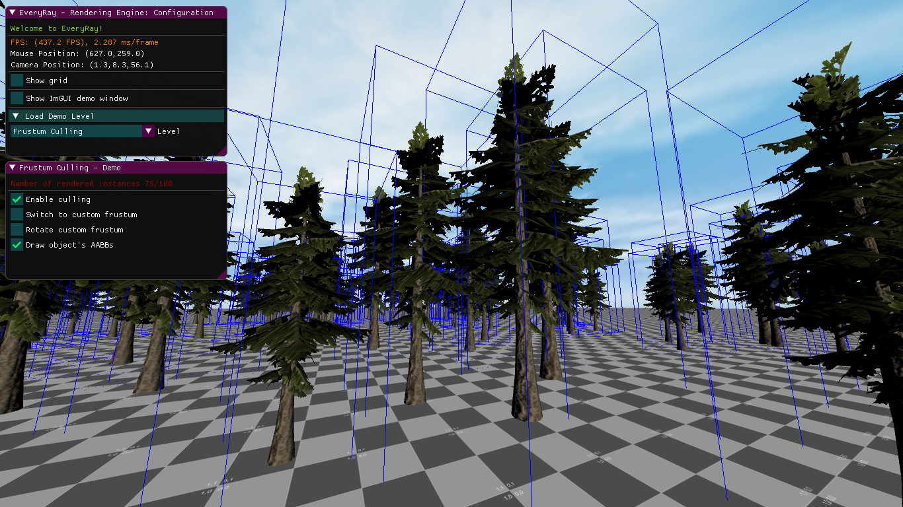
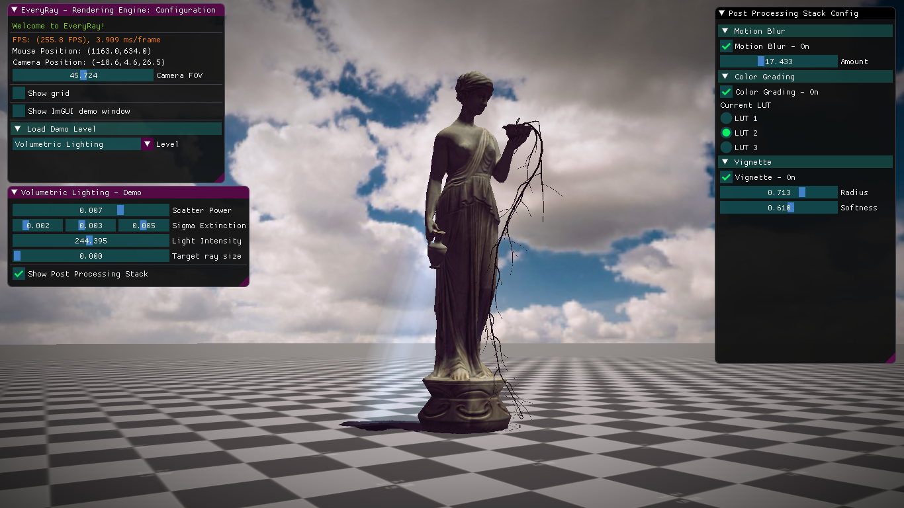

# EveryRay-Rendering-Engine
Rendering engine/framework written in C++/DirectX 11. 

# Some of the features
- Hybrid Rendering (Deferred Prepass with GBuffer + Forward Pass)
- 3D model loading (.obj, .fbx and etc.) with Assimp Library
- User Interface with ImGUI, ImGuizmo
- AABB, OBB, collision detection
- Normal-Mapping, Environment-Mapping
- Post Processing: Motion Blur, Vignette, LUT color grading, FXAA, Tonemap, Bloom
- Physically Based Rendering with IBL
- Cascaded Shadow Mapping
- GPU Instancing
- Frustum Culling
- Separable Subsurface Scattering (based on the work of J.Jimenez and D.Gutierrez)
- Screen Space Reflections
- Terrain with tessellation and foliage rendering

Other features based on NVIDIA techniques (no code provided here)
- Volumetric Lighting (from "Fast, Flexible, Physically-Based Volumetric Light Scattering")
- Ocean Simulation (from DX11 archive samples)

# Screenshots

# Controls
- Mouse + Right Click - camera rotation
- WASD - camera side movement
- E/Q - camera up/down movement
- Backspace - enable editor
- R/T/Y - scale/translate/rotate object in the editor mode

# Notes
Only "Sponza Main Demo" and "Test Scene" have almost all the features and are up-to-date with the changes to the codebase. Other levels suffer from legacy issues and might not have, for example, up to date code, such as RenderingObject, working editor or post processing stack... I will be refactoring those levels when possible. 

If you would like to run "Terrain Demo Scene", then you might increase TDR time of your GPU driver (explained here https://docs.substance3d.com/spdoc/gpu-drivers-crash-with-long-computations-128745489.html). In this particular level I currently place objects on the terrain during loading and exectue several compute shader dispatches for that. It takes around 2 minutes to load a level on my RTX2060.

The framework is NOT API-agnostic and, thus, is tighly bound to DX11. Hopefully, I will be changing that in the future.

# External Dependencies
Create a folder "external" in the root directory and place these built libraries
- DirectX Effects 11 (https://github.com/Microsoft/FX11)
- DirectXTK (https://github.com/Microsoft/DirectXTK)
- ImGui (https://github.com/ocornut/imgui)
- Assimp 5.0.1 (https://github.com/assimp/assimp)

# References
"Real-Time 3D Rendering with DirectX and HLSL: A Practical Guide to Graphics Programming" by Paul Varcholik.

# Requirements
- Visual Studio 2017
- Windows 10 + SDK
- DirectX 11 supported hardware
